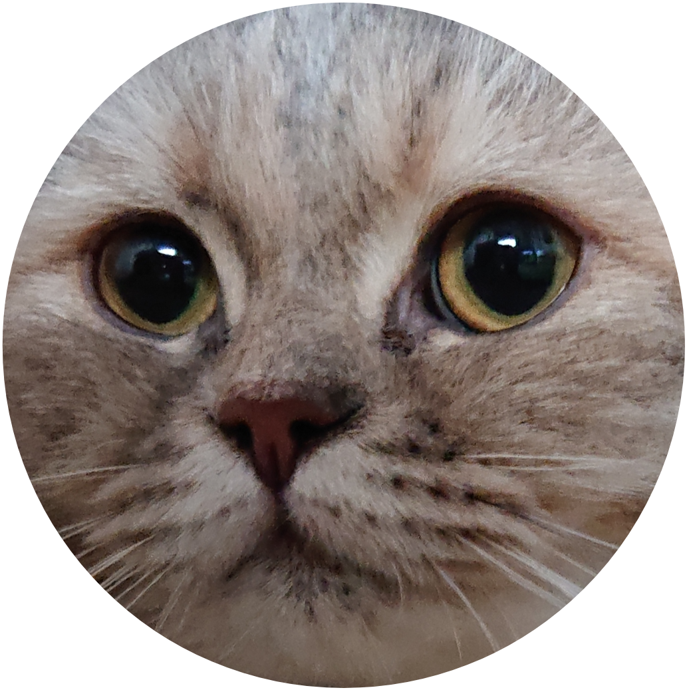
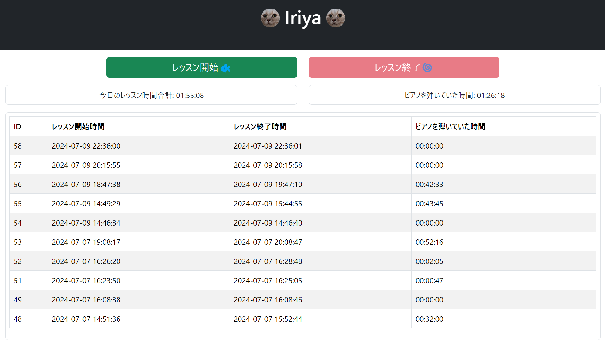

# Iriya - Piano Practice Recording System v1.0 




[English](#english) | [日本語](#日本語) <br>
[Lisence](#lisence)


## English

This project is a piano practice recording system that receives MIDI signals from an electronic piano to a Raspberry Pi (any console that can use Python is also acceptable). It uses Dash (Python) to record practice times, accessible from a smartphone or PC browser.

### Features
- Recording practice time
- Recording the actual time spent playing the piano via MIDI signals (no cheating feature)
- Access from smartphone or PC browser (utilizing Dash)
- Displaying practice history

### Planned Features
- Displaying statistical graphs related to practice
- Real-time monitoring of sound dynamics

### Requirements
- Raspberry Pi (any environment where Python and USB are available)
- Electronic piano with MIDI output
- MIDI to USB cable (connect the OUT side of the piano's MIDI to the IN side of the cable)

### Installation

1. Clone the repository:
    ```bash
    git clone https://github.com/anmo-fish/iriya-piano-practice.git
    cd piano-practice-recording-system
    ```

2. Create a virtual environment and install dependencies:
    ```bash
    python -m venv venv
    source venv/bin/activate
    pip install -r requirements.txt
    ```

3. Change settings in src/config.py:
    ```python
    # Be sure to enter the device name (use aconnect -l on Linux, or find out the method for other platforms)
    # Change the language setting as needed
    MIDI_DEVICE = "your device name"
    ```

### Start Development Environment
```bash
python run_dev.py
```

### Production Environment
Run the following command in the root directory of the project:
```
gunicorn src.app:server -b 0.0.0.0:8050
```

### Usage
Access `http://localhost:8050` in your browser.
To access from another device, replace `localhost` with the local IP address of the console running the application.

## 日本語

このプロジェクトは、電子ピアノからRaspberry Pi(pythonが使えればその他のコンソールでもOK)にMIDI信号を受信するピアノ練習記録システムです。Dash（Python）を使用して練習時間を記録し、スマートフォンやPCのブラウザからアクセスできます。

### 機能
- 練習時間の記録
- MIDI信号経由で実際にピアノを弾いていた時間も記録できます(ズルはだめだぞ機能)
- スマートフォンやPCのブラウザからアクセス(Dashを利用しています)
- 練習履歴の表示

### 近い将来に追加される予定
- 練習に関する統計グラフの表示
- 音の強弱をリアルタイムでモニタリングする機能

### 要件
- Raspberry Pi(pythonとUSBが使える環境なら何でもいい)
- MIDI出力付きの電子ピアノ
- MIDI to USBケーブル（ピアノのMIDIのOUT側にケーブルのIN側を差す）

### インストール

1. リポジトリをクローンする:
    ```bash
    git clone https://github.com/anmo-fish/iriya-piano-practice.git
    cd piano-practice-recording-system
    ```

2. 仮想環境を作成し、依存関係をインストールする:
    ```bash
    python -m venv venv
    source venv/bin/activate
    pip install -r requirements.txt
    ```

3. src/config.pyで設定を変更する:
    ```
    # デバイス名は必ず入れる(linuxならaconnect -lで、ほかのプラットフォームの場合は自分で調べてください)
    # 言語設定は適宜変える
    MIDI_DEVICE = "your device name"
    ```

### 開発環境の起動
```bash
python run_dev.py
```
### 本番環境
以下のコマンドをプロジェクトのルートディレクトリで実行
```
gunicorn src.app:server -b 0.0.0.0:8050
```

### 使い方
ブラウザで `http://localhost:8050` にアクセスします。
別のデバイスからアクセスするにはlocalhostの部分を実行しているコンソールのローカルipアドレスにしてください。

# Lisence

This project is licensed under the MIT License, see the LICENSE.txt file for details

# 

Iriya / Siberian Forest Cat / Female / Born in 2019
